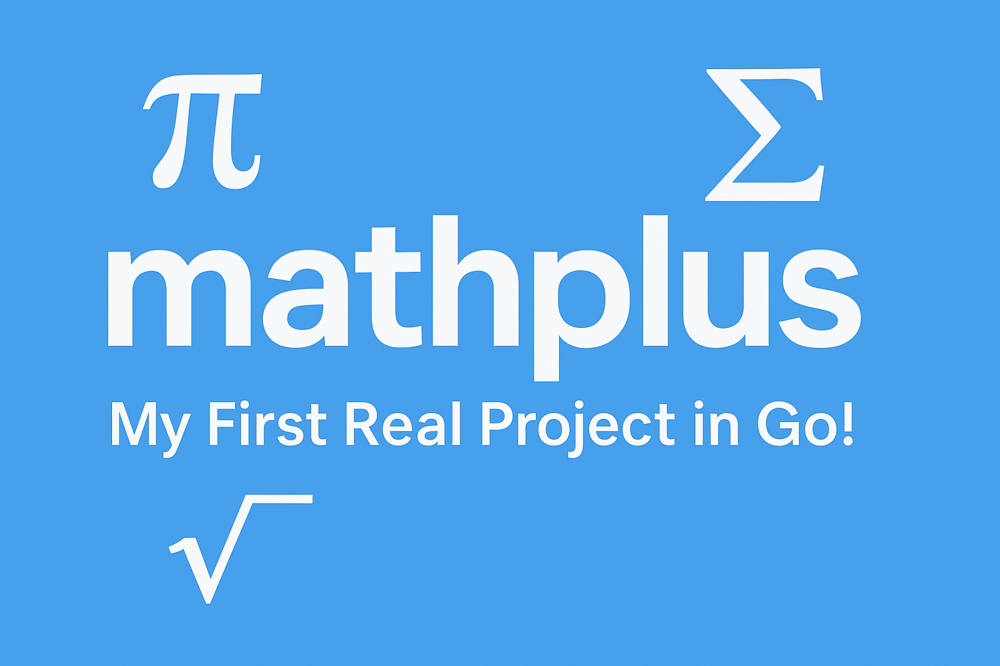

> 💡 Started as a side exercise… now it’s my first open-source package!

# mathplus



A mathematical Go library with extended basic functions, statistic functions, logic functions and trigonometric functions. Ideal for personal use or as a foundation for projects that require calcularions beyond standard `math`.

## ✨ Main functionalities

- ➕ Arithmetic: addition, subtraction, multiplication, division, power, square root
- 🧮 Numeric logic: factorial, prime checking, LCM, MCD
- 📊 Statistics: average, median, mode, standard deviation
- 📐 Trigonometry: sine, cosine, tangeant
- 🔢 Extremes: minimum and maximum values with NaN and ±Inf support
- 🧠 Logarithms: naturals, base 2, base 10, custom base, Log1p and Logb
- ⚙️ Auxiliar functions: absolute value, error control

And I'm open for suggestions if any important functions are missing!

## 🛠️ Installation

`go get github.com/HugoCodesig/mathplus`

## 🧪 Use examples

```go
package main

import (
    "fmt"
    "github.com/HugoCodesig/mathplus"
)

func main() {
    fmt.Println("Sum:", mathplus.Add(1, 2, 3))                     // 6
    fmt.Println("Average:", mathplus.Avg(10, 20, 30))              // 20
    fmt.Println("Median:", mathplus.Med(3, 1, 4, 2))               // 2.5
    fmt.Println("Moda:", mathplus.Mode(1, 2, 2, 3, 3, 3, 4))       // [3]
    fmt.Println("Is 17 prime:", mathplus.IsPrime(17))              // true
    fmt.Println("Factorial 5:", mathplus.Factorial(5))             // 120
    fmt.Println("Máximo:", mathplus.Max(2, 4, 6, math.Inf(1)))     // +Inf
}
```

## 📁 File structure

`arithmetic.go` – Basic arithmetic operations

`statistics.go` – Statistic functions

`logic.go` – Logic functions with floating point numbers

`extremes.go` – Minimum and maximum calculations

`logs.go` – Basic and extended logarithms

`trigonometry.go` – Trigonometric functions

`utils.go` – Auxiliar functions

## Useful commands

### 📦 Installation and execution

```bash
git clone https://github.com/HugoCodesig/mathplus.git
cd mathplus
make build
./mathplus add -p 2 3
```

### 🧪 Tests

```bash
make test        # Execute all tests
make test-cli    # Execute CLI tests + temporary binary file (for testing)
```

### ▶️ CLI

```bash
./mathplus <function> -p <numbers>

# Examples
./mathplus add -p 5 3         # 8
./mathplus div -p 100 2 5     # 10
```

### 📚 Supported Operations

| **Function**       | **Description**                                    | **CLI Example**                               |
|--------------------|----------------------------------------------------|-----------------------------------------------|
| `add`              | Sum all numbers                                    | `mathplus add -p 4 5 6` → `15`                |
| `sub`              | Subtract numbers left to right                     | `mathplus sub -p 10 2 3` → `5`                |
| `mul`              | Multiply all numbers                               | `mathplus mul -p 2 3 4` → `24`                |
| `div`              | Divide numbers left to right                       | `mathplus div -p 100 2 5` → `10`              |
| `pow`              | Raise base to exponent                             | `mathplus pow -p 2 3` → `8`                   |
| `sqrt`             | Square root (Newton's method)                      | `mathplus sqrt -p 25` → `5`                   |
| `average`          | Arithmetic mean                                    | `mathplus average -p 5 10 15` → `10`          |
| `median`           | Median value                                       | `mathplus median -p 1 3 2` → `2`              |
| `mode`             | Most frequent number(s)                            | `mathplus mode -p 2 2 3 4` → `[2]`            |
| `stddev`           | Sample standard deviation                          | `mathplus stddev -p 2 4 6` → `2`              |
| `factorial`        | Factorial (recursive, integers only)               | `mathplus factorial -p 5` → `120`             |
| `isprime`          | Check if integer is prime                          | `mathplus isprime -p 7` → `true`              |
| `gcd`              | Greatest common divisor                            | `mathplus gcd -p 12 18` → `6`                 |
| `lcm`              | Least common multiple                              | `mathplus lcm -p 4 6` → `12`                  |
| `max`              | Maximum in list                                    | `mathplus max -p 3 7 2` → `7`                 |
| `min`              | Minimum in list                                    | `mathplus min -p 3 7 2` → `2`                 |
| `log`              | Logarithm (base 10, 2, or natural)                 | `mathplus log -p 10` → `2.3` _(base 10)_      |
| `logspec`          | Special log forms: `log1p`, `logb`                 | `mathplus logspec -p 1p 0.5` → `~0.405`       |
| `sin` / `cos` / `tan` | Trigonometric functions (input in radians)      | `mathplus sin -p 1.5708` → `1`                |

## Info
This took around three weeks to make, with nonstop documentation checking and AI help. And finally, after those painful weeks, I finally completed it!
Special thanks to the Golang documentation and Copilot AI (not the best but oh well). Feel free to send feedback. :D
